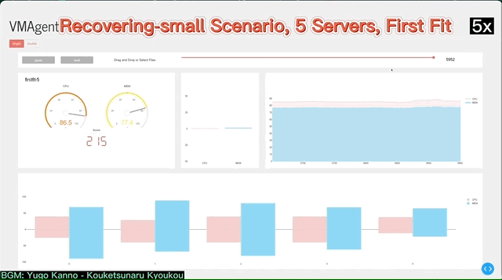

# [](https://vmagent.readthedocs.io/en/latest/)

**VMAgent** is a platform for exploiting Reinforcement Learning (RL) on Virtual Machine (VM) scheduling tasks.
VMAgent is constructed based on one month real VM scheduling dataset called [*Huawei-East-1*](https://vmagent.readthedocs.io/en/latest/simulator/dataset.html) from [**HUAWEI Cloud**](https://www.huaweicloud.com) and it contains multiple practicle VM scheduling scenarios (such as Fading, Rcovering, etc).
These scenarios also correspond to the challanges in the RL.
Exploiting the design of RL methods in these secenarios help both the RL and VM scheduling communities.
To emphasis, more details about VMAgent can be found in our paper [*VMAgent: Scheduling Simulator for Reinforcement Learning*](https://arxiv.org/abs/2112.04785).
Our another paper [*Learning to Schedule Multi-NUMA Virtual Machines via Reinforcement Learning*](https://www.sciencedirect.com/science/article/abs/pii/S0031320321004349) has employed this VMAgent simultor to design RL-based VM scheduling algorithms.

**Key Components of VMAgent**:
* SchedGym (Simulator): it provides many practical scenarios and flexible configurations to define custom scenarios.
* SchedAgent (Algorithms): it provides many popular RL methods as the baselines.
* SchedVis (Visulization): it provides the visualization of schedlueing dynamics on many metrics.
## Scenarios and Baselines

The VMAgent provides multiple practical scenarios: 
| Scenario     | Allow-Deletion | Allow-Expansion | Server Num |
|--------------|----------------|-----------------|------------|
| Fading       | False          | False           | Small      |
| Recovering   | True           | False           | Small      |
| Expanding    | True           | True            | Small      |
| Recovering-L | True           | False           | Large      |

Researchers can also flexibly customized their scenarios in the `vmagent/config/` folder.


Besides, we provides many baselines for quick startups.
It includes FirstFit, BestFit, DQN, PPO, A2C and SAC.
More baselines is coming.
## Installation 

```
git clone git@github.com:mail-ecnu/VMAgent.git
cd VMAgent
conda env create -f conda_env.yml
conda activate VMAgent-dev
python3 setup.py develop
```

## Quick Examples

In this quick example, we show how to train a dqn agent in a fading scenario. 
For more examples and the configurations' concrete definitions, we refer readers to our [docs](https://VNAgent.readthedocs.io/en/latest/).

config/fading.yaml:
```yaml
N: 5
cpu: 40 
mem: 90
allow_release: False
```
config/algs/dqn.yaml:
```yaml
mac: 'vectormac'
learner: 'q_learner'
agent: 'DQNAgent'
```
Then 
```sh
python train.py --env=fading --alg=dqn
```

It provides the first VM scheudling simulator based on the one month east china data in **HUAWEI Cloud**.
It includes three scenarios in practical cloud: Recovering, Fading and Expansion.
Our video is at [video](https://drive.google.com/file/d/14EkVzUnEXM7b8YNJiZ6cxLxhcj5yW4V_/view?usp=sharing).
Some demonstrations are listed:

## Docs

For more information of our VMAgent, we refer the readers to the [document](https://vmagent.readthedocs.io/en/latest/).
It describes the detail of SchedGym, SchedAgent and SchedVis.

## Data 

We collect one month scheduling data in east china region of huawei cloud.
The format and the stastical analysis of the data are presented in the docs.
one month east china data in huawei cloud.

## Visualization


For visualization, see the [`schedvis`](./schedvis) directory in detail.

## References
- Junjie Sheng, Shengliang Cai, Haochuan Cui, Wenhao Li, Yun Hua, Bo Jin, Wenli Zhou, Yiqiu Hu, Lei Zhu, Qian Peng, Hongyuan Zha and Xiangfeng Wang, VMAgent: Scheduling Simulator for Reinforcement Learning. arXiv preprint arXiv:2112.04785, 2021.
- Junjie Sheng, Yiqiu Hu, Wenli Zhou, Lei Zhu, Bo Jin, Jun Wang and Xiangfeng Wang, Learning to Schedule Multi-NUMA Virtual Machines via Reinforcement Learning, Pattern Recognition, 121, 2021, pp.108254.

## License
Licensed under the [MIT](./LICENSE) License.
