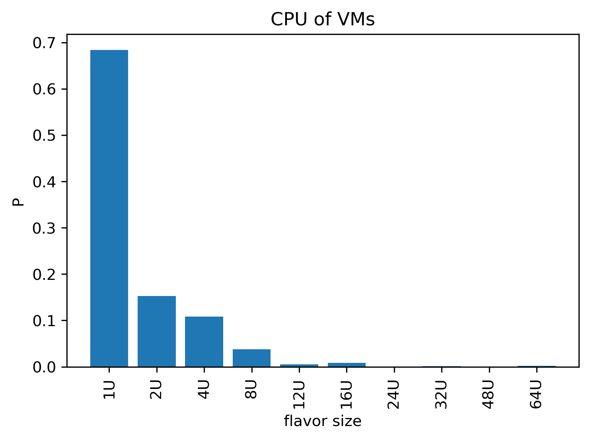
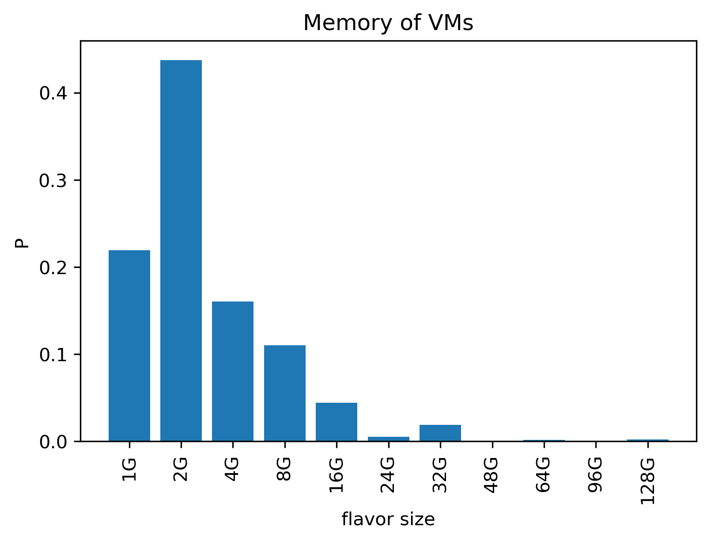
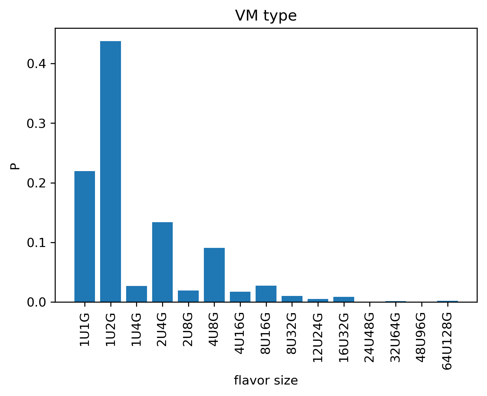
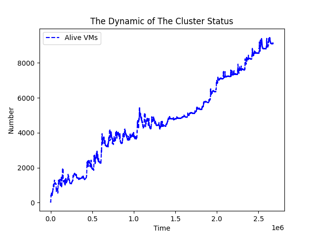
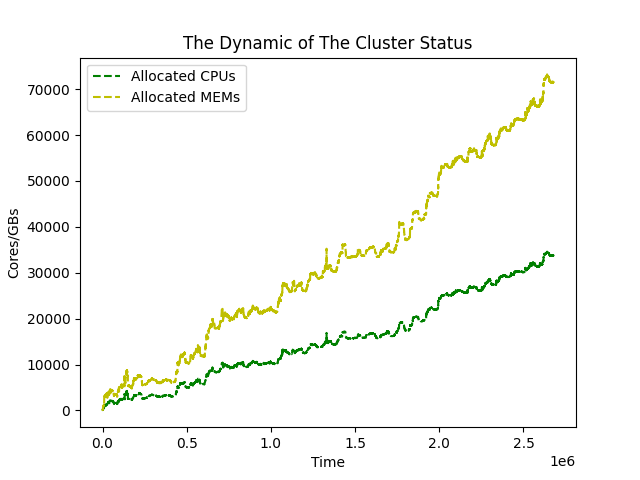

# Dataset 
Our VMAgent collects the **real scheduling data in huawei cloud** for one month.
The [dataset](https://github.com/mail-ecnu/VMAgent/blob/master/vmagent/data/dataset.csv) is placed in our repository.

## Statistical Analysis
The statsical information of the dataset is listed below.

| Number of  VM types | Number of  creation requests | Number of  deletion requests | Time duration | Server location |
|---------------------|------------------------------|------------------------------|---------------|-----------------|
| 15                  | 125430                       | 116313                       | 30 Days       | East China      |

To gain better understanding of the cpu and memory distribution, we plot the histograms of the cpu and memory.

More than 2/3 requests only consumes 1U and less than 2G.
We also plot the statiscs of the (cpu, mem) request:

The 1U1G,1U2G, 2U4G and 4U8G constitues the main body of the requests.

We also visualize the dynamic of virtual machine during the month: 

Although there exists deletion request, the number of alive virtual machines increses from 0 to more than 8000.
It should be noted that, even in the one month, the VM's dynamic is highly related to the time.
`Increase, Flux, Increase, Flux` happens through the one month.

We also visualize the allocated cpu and memory dynamic above.
They can be helpful in constructing domain knowledge.

## Naive Baselines performance
Another way to describe the dataset is measuring performance of naive baselines in the dataset.
We adopt First-Fit and Best-Fit as the naive baselines and conduct experiments on different settings.

We conduct fading and recovering experiments with 5, 20, 50 servers and each server has 40 cpu and 90 memeory.

| Scenario   | Number of  servers | Method   | Number of Allocations | Terminated CPU Rate | Terminated MEM Rate |
|------------|--------------------|----------|-----------------------|---------------------|---------------------|
| Fading     | 5                  | BestFit  | 211.7 \pm 30          | 91.6% \pm 9.4%      | 83.6% \pm 9.2%      |
|            |                    | FirstFit | 224.5 \pm 28          | 98.3% \pm 1.9%      | 90.0% \pm 1.9%      |
|            | 20                 | BestFit  | 735.1 \pm 83          | 63.5% \pm 29.2%     | 35.7% \pm 21.9%     |
|            |                    | FirstFit | 888.0 \pm 65          | 91.6% \pm 8.5%      | 64.7 \pm 5.6%       |
|            | 50                 | BestFit  | 1674.5 \pm 28         | 91.6% \pm 1.1%      | 84.3 \pm 1.0%       |
|            |                    | FirstFit | 2298.3 \pm 19         | 95.5% \pm 0.7%      | 91.5% \pm 0.5%      |
| Recovering | 5                  | BestFit  | 221.1 \pm 29          | 96.3% \pm 5.6%      | 88.1% \pm 5.7%      |
|            |                    | FirstFit | 222.7 \pm 27          | 97.2% \pm 3.4%      | 89.0% \pm 3.4%      |
|            | 20                 | BestFit  | 850.0 \pm 13          | 99.1% \pm 0         | 95.8% \pm 0         |
|            |                    | FirstFit | 926.1 \pm  10         | 98.7% \pm 0.5%      | 96.5% \pm 0.3%      |
|            | 50                 | BestFit  | 1829.6 \pm 37         | 92.8% \pm 1.4%      | 88.8% \pm 0.2%      |
|            |                    | FirstFit | 2301.7 \pm 19         | 95.0% \pm 0.5%      | 91.1% \pm 0.4%      |