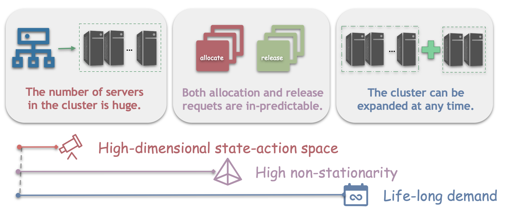
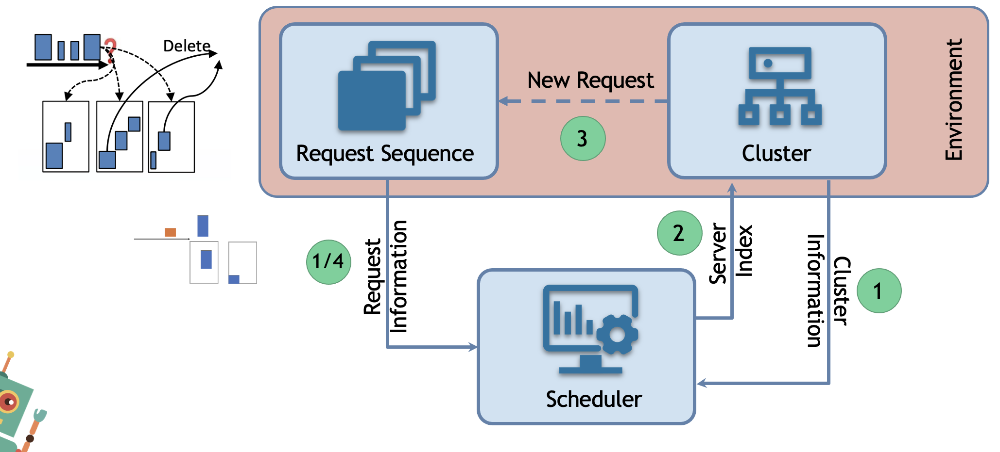

# Scenarios
Our VMAgent provides multiple virtual machine scheduling scenarios in the practical cloud computing.
These scenarios differ from each other on the cluster's feature and the request's feature.
Moreover, these different scenarios also pose different perspective difficluties on the reinforcement learning methods.
We summarize the cluster features, request features and their corresponding difficuluties on RL below.

## Scheduling 
The virtual machine scheduling problem can be divided into three main components: Request Sequence, Cluster and Scheduler.

Breifly speaking, a number of users request virtual machine resources and proposes requests sequentially.
Each time the scheduler observes a request, it will check the cluster and find a server in the cluster to handle the request.
The server then allocate corresponding resources for the request.
When there are no server in the cluster can handle the request, the scheduler will be terminated.
The scheduler is designed to avoid termination.

## Cluster 
For a cluster, it includes N servers. 
The server often has its attribute (c, m, numas) where the numas is the number of numa it has and the c and m are the number of the cpu and memory each numa has. 
In our VMAgent, the c=40, m=90 and the numas=2.
For a RL scheduler, if the N increases, then the state and action dimension exponentially increase.

A cluster also featured by whether it can expand the servers. 
In practical scenarios, the cloud service provider needs to ensure the cluster never terminated because of the short of server resources. 
Thus they often buy a bunch of servers when the availiable resources in the cluster are lower than the threshold.
With more servers added, the RL scheduler will face a different problem and this makes it a life-long learning challanges.

## Request
For the request, it contains (rc, rm) where the rc and rm are the number of cpu and memory it needs.
The requests can be divided into two categories: creation request and deletion request.
For the creation request, the cluster need to assign corresponding resources to it.
For the deletion request, the clueter need to find where the resources that the request occupied and remove it.
In dedicated cloud, users often buy the servers for a long time and the deletion requests are few.
While for public cloud, the deletion requests happen more frequently.
This brings a high non-stationary challange for the RL scheduler.

